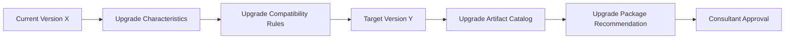

# Process

## AS-IS

1. A customer requests an upgrade from Current Version X.
2. A consultant checks relevant Upgrade characteristics.
3. The consultant selects Target Version Y using available rules or documentation.
4. The consultant identifies required upgrade files.
5. The consultant prepares the result.

## TO-BE

1. The system receives Current Version X and available request information.
2. It validates required Upgrade characteristics.
3. Upgrade Compatibility Rules determine Target Version Y.
4. The Upgrade Artifact Catalog maps Target Version Y to an Upgrade Package.
5. The system generates a traceable recommendation.
6. A consultant approves, corrects, or rejects it.

Rules and mappings are conceptual. Any future examples must be fictional.
