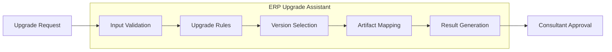

# Architecture

## Logical Architecture

The concept uses one logical system, **ERP Upgrade Assistant**. Its responsibilities are modules within the same solution, not independently deployed microservices.

- **Input Validation:** Validates required inputs and Upgrade characteristics.
- **Upgrade Rules:** Applies deterministic Upgrade Compatibility Rules.
- **Version Selection:** Selects the applicable Target Version.
- **Artifact Mapping:** Maps the Target Version through the Upgrade Artifact Catalog.
- **Result Generation:** Produces a traceable Upgrade Package recommendation.

## Boundaries

- No cloud provider, framework, database, or programming language is selected.
- Storage mechanisms for rules and the artifact catalog remain undecided.
- The assistant recommends; it does not execute upgrades.
- Consultant approval is the final decision point.
