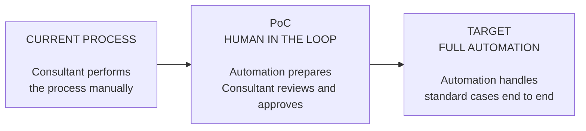
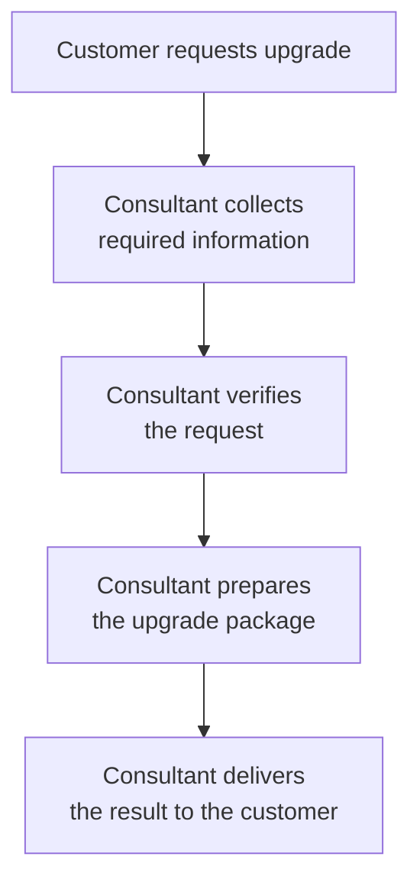
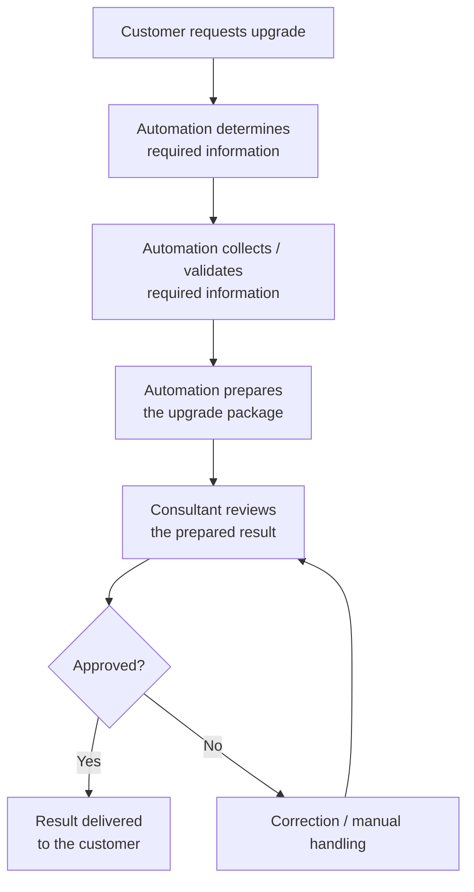
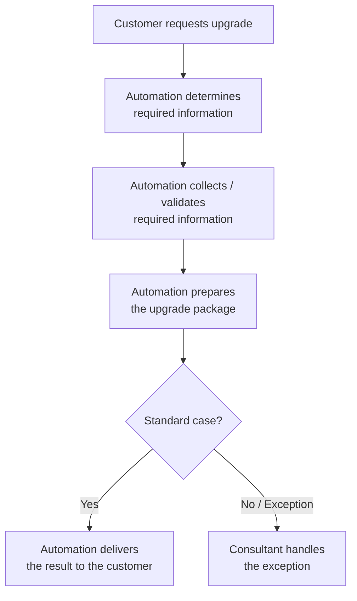

# Upgrade Process Evolution

This document presents the evolution of the upgrade request process from the current manual workflow, through a controlled Proof of Concept (PoC), to the target state with full automation.

The diagrams intentionally stay at business-process level and avoid infrastructure-specific implementation details.

---

## 1. Process Evolution

**Evolution:** manual process → controlled automation → full automation for standard cases.

---

## 2. Current Process

### Key point

**The consultant performs the whole process manually.**

---

## 3. PoC — Human in the Loop

### Key point

**Automation performs the repetitive work, while the consultant keeps final control.**

This stage validates whether the process is reliable enough before removing the mandatory human approval step.

---

## 4. Target Process — Full Automation

### Key point

**Standard cases are handled automatically end to end. Exceptions are routed to a consultant.**

---

## Decision Logic

The PoC is not the final operating model.

Its purpose is to verify that the automated process can reliably prepare the correct result while a consultant remains the final approval gate.

If the PoC confirms sufficient reliability and business value, the process can evolve toward full automation for standard cases, with consultants handling only exceptions.
